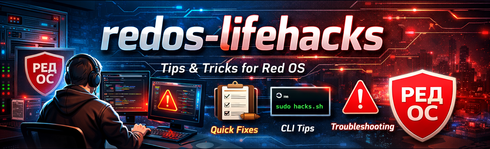

# 🐧 RED OS: Ready-made solutions and scripts

[](/LICENSE)
[](https://redos.red-soft.ru/)
[](https://github.com/teanrus/redos-lifehacks/releases)
[](https://github.com/teanrus/redos-lifehacks/stargazers)



<!-- > 💡 **Если вы ищете быстрые инструкции и скрипты для администрирования РЕД ОС — этот репозиторий поможет собрать рабочее место за 10–15 минут.**

Коллекция проверенных решений, скриптов и настроек для комфортной работы в РЕД ОС 7/8. -->

**Для кого:**

- 🔧 IT-администраторы и системные инженеры
- 🏢 Системные интеграторы
- 👥 Корпоративные пользователи РЕД ОС
- 🎧 Специалисты технической поддержки

## 📑 Оглавление

- [🔒 Совместимость и требования](#-совместимость-и-требования)
- [📦 Что внутри](#-что-внутри)
    - [📚 docs — Документация и руководства](#-docs--документация-и-руководства)
    - [🤖 scripts — Автоматизация](#-scripts--автоматизация)
    - [🛠️ tools — Диагностика](#️-tools--диагностика)
- [📊 Сравнение версий 7.x и 8.x](#-сравнение-версий-7x-и-8x)
- [🔑 Ключевые скрипты](#-ключевые-скрипты)
- [🔥 Популярные лайфхаки](#-популярные-лайфхаки)
- [🔒 Проверка целостности скриптов](#-проверка-целостности-скриптов)
- [⭐ Если этот репозиторий помог вам, поставьте звезду!](#-если-этот-репозиторий-помог-вам-поставьте-звезду)
- [Вместе сделаем работу в РЕД ОС удобнее и эффективнее](#вместе-сделаем-работу-в-ред-ос-удобнее-и-эффективнее)

## 📖 Wiki

Расширенная документация доступна в [Wiki](https://github.com/teanrus/redos-lifehacks/wiki):

- 📊 Сравнение версий РЕД ОС 7.x и 8.x
- 📋 Руководства по миграции
- 🔍 Диагностика сложных проблем
- 💡 Дополнительные сценарии использования

> [!tip]
> Wiki регулярно обновляется новыми статьями и руководствами.

## 🚀 Как начать

1. **Найдите нужное решение** — изучите разделы ниже или используйте поиск (`Ctrl+F`)
2. **Откройте документацию** — перейдите в [`docs/`](/docs/readme.md) или [`scripts/`](/scripts/readme.md)
3. **Скачайте скрипт** — из релиза или напрямую из репозитория
4. **Проверьте контрольную сумму** — обязательно сверьте SHA256 перед запуском
5. **Запустите с правами root** — используйте `sudo bash script.sh`

```bash
# Пример: установка КриптоПро
curl -sL https://github.com/teanrus/redos-lifehacks/releases/download/v1.0/install-cryptopro.sh -o install-cryptopro.sh
sha256sum -c install-cryptopro.sh.sha256  # Проверка
sudo bash install-cryptopro.sh             # Запуск
```

## 🔒 Совместимость и требования

| Параметр | Значение |
| -------- | -------- |
| **ОС** | РЕД ОС 7.3 / 8.x (основная поддержка) |
| **Совместимость** | Может работать на других RPM-дистрибутивах (CentOS, Fedora) |
| **Права** | Требуется `root` или `sudo` для большинства скриптов |
| **Безопасность** | Обязательная проверка SHA256 перед запуском |

> [!important]
> Никогда не запускайте скрипты без проверки контрольных сумм и ознакомления с кодом!

## 📦 Что внутри

### 📚 [docs](/docs/readme.md) — Документация и руководства

- 🖥️ [desktop](/docs/desktop/readme.md) — рабочий стол: SSHFS, автодополнение, многомониторная настройка
- 📦 [installation](/docs/installation/readme.md) — установка: офисные пакеты, CUPS, сканеры, USB
- 🌐 [network](/docs/network/readme.md) — сеть: прокси, VPN, Wi-Fi, rsync
- ⚡ [optimization](/docs/optimization/readme.md) — производительность: DNF, SSD, swap
- 🔒 [security](/docs/security/readme.md) — безопасность: аудит, firewall, шифрование
- 🔧 [troubleshooting](/docs/troubleshooting/readme.md) — исправление проблем: звук, графика, принтеры
- 🔌 [peripheral](/docs/peripheral/readme.md) — периферия: принтеры, сканеры, смарт-карты
- 📊 [monitoring](/docs/monitoring/readme.md) — мониторинг: логи, совместимость оборудования

### 🤖 [scripts](/scripts/readme.md) — Автоматизация

- ⚙️ [setup](/scripts/setup/readme.md) — базовая настройка системы
- 📦 [install](/scripts/install/readme.md) — установка ПО: 1С, КриптоПро, мессенджеры, ViPNet
- 🧹 [utils](/scripts/utils/readme.md) — утилиты: очистка, USB-блокировка, сетевые шары
- 📊 [monitoring](/scripts/monitoring/readme.md) — диагностика и автообновление

### 🛠️ [tools](/tools/readme.md) — Диагностика

Проверка обновлений, анализ диска, информация о системе

**Результаты:**

- ⚡ Быстрый старт — настройка за 10-15 минут
- 📦 Установка корпоративного ПО — 1С, КриптоПро, Р7-Офис
- 🚀 Оптимизация — ускорение DNF, TRIM для SSD, управление swap
- 🔐 Безопасность — настройка VPN, firewall, USB-блокировка

## 📊 [Сравнение версий 7.x и 8.x](https://github.com/teanrus/redos-lifehacks/wiki/Versions-Comparison)

Подробная таблица отличий доступна в [Wiki](https://github.com/teanrus/redos-lifehacks/wiki/Versions-Comparison): ядро, рабочие столы, пакеты, безопасность, сроки поддержки, руководство по обновлению

## 🔑 Ключевые скрипты

| Скрипт | Назначение |
| ------ | --------- |
| 💬 [install-messengers](scripts/install/install-messengers.md) | Telegram, Среда, MAX, VK Messenger |
| 🔐 [install-cryptopro](scripts/install/install-cryptopro.md) | КриптоПро CSP + Рутокен |
| 🛡️ [install-vipnet](scripts/install/install-vipnet.md) | ViPNet Client VPN |
| 🏢 [install-1c](scripts/install/install-1c.md) | 1С:Предприятие + PostgreSQL |
| 🗑️ [cleanup](scripts/utils/cleanup.md) | Очистка системы и кэша |
| ⏰ [redos-auto-update](scripts/monitoring/redos-auto-update.md) | Автообновление по расписанию |
| 🖥️ [mount-manager](scripts/utils/mount-manager.md) | Сетевые шары CIFS/SMB |
| 🔄 [user-migration](scripts/utils/user-migration.md) | Миграция пользователя и перенос данных |
| 🔒 [usb-guard](scripts/utils/usb-guard.md) | Блокировка USB-накопителей |

> 📦 Полный пакет автоматизации: [redos-setup](https://github.com/teanrus/redos-setup) — базовая настройка АРМ за один запуск

## 🔥 Популярные лайфхаки

1. Ускорение DNF в 10 раз

    ```bash
    echo "max_parallel_downloads=10" | sudo tee -a /etc/dnf/dnf.conf
    ```

2. Отключение SELinux (для совместимости с некоторым ПО)

    ```bash
    sudo sed -i 's/SELINUX=enforcing/SELINUX=disabled/' /etc/selinux/config
    ```

3. Монтирование удаленной папки через SSH

    ```bash
    sshfs user@server:/remote/path /local/mount/point
    ```

4. Быстрая установка всех обновлений

    ```bash
    sudo dnf update -y
    ```

5. Настройка TRIM для SSD

    ```bash
    sudo systemctl enable --now fstrim.timer
    ```

## 🔒 Проверка целостности скриптов

Каждый скрипт в Release сопровождается файом `.sha256` с контрольной суммой.
Это гарантирует, что файл не был изменён при доставке.

### Быстрая проверка

```bash
# 1. Скачиваем скрипт и файл контрольной суммы
curl -sL https://github.com/teanrus/redos-lifehacks/releases/download/v1.0/install-cryptopro.sh -o install-cryptopro.sh
curl -sL https://github.com/teanrus/redos-lifehacks/releases/download/v1.0/install-cryptopro.sh.sha256 -o install-cryptopro.sh.sha256

# 2. Проверяем совпадение
sha256sum -c install-cryptopro.sh.sha256
# install-cryptopro.sh: OK

# 3. Запускаем (только после успешной проверки!)
sudo bash install-cryptopro.sh
```

> [!important]
> Никогда не запускайте скрипты из интернета без проверки контрольных сумм!

---

> [!tip]
> **Как внести свой вклад** → см. [CONTRIBUTING.md](CONTRIBUTING.md)

### ⭐ Если этот репозиторий помог вам, поставьте звезду!

### Вместе сделаем работу в РЕД ОС удобнее и эффективнее

[](https://github.com/teanrus/redos-lifehacks/wiki)
[](CHANGELOG.md)
[](CONTRIBUTING.md)
[](https://github.com/teanrus/redos-lifehacks/stargazers)
